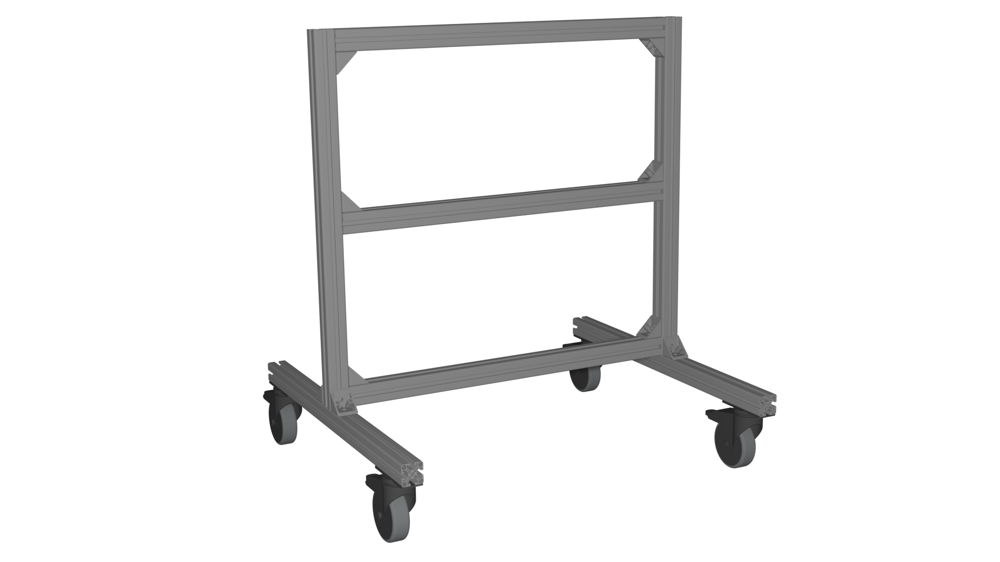
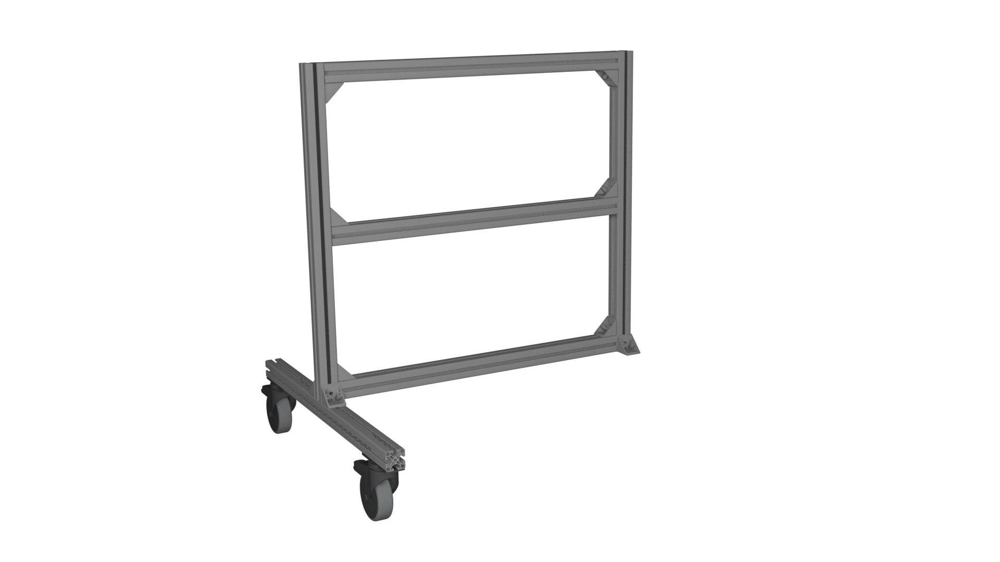
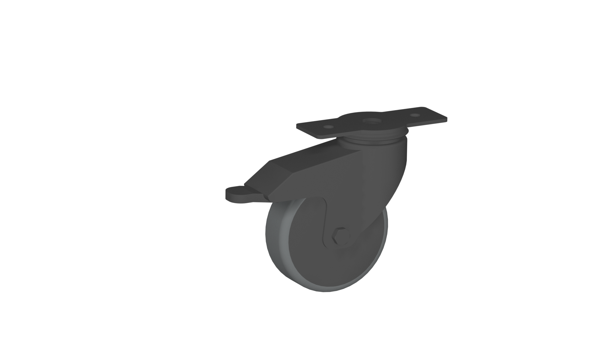
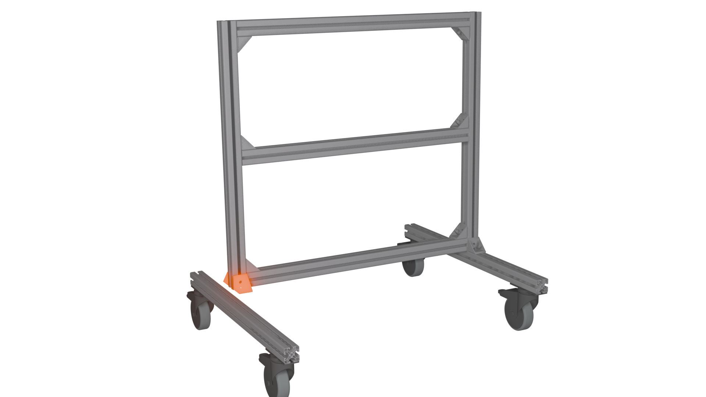

# Namenskonvention Montagepläne

Es wird eine Unterteilung der Montagepläne in verschiedene Zustände vorgenommen:

- **Assemblies**: fertige Baugruppen im Montageplan
- **Assemblies_intermediate_states**: Zwischenzustände während dem Erstellen der 
Baugruppen
- **Atomic_parts**: elementare Bauteile, die nicht weiter aufgeteilt werden können
- **Steps**: explizite Darstellung der Montageschritte zum erstellen von 
Assemblies_intermediate_states und Assemblies

Die Namensgebung soll in den Renderings, Dokumentationen sowie JSON-Montageplänen 
konsistent gehalten werden. 

## Assemblies

Fertige Baugruppe möglichst präzise und kurz beschrieben.   
Exemplarisch am Werkstattwagen „trolley“:

## Assemblies_intermediate_states

Zwischenzustände werden wie folgt benannt: *final-assembly_state-description* wobei:  
*final-assembly* die zu konstruierende Baugruppe ist (Bsp. Frame)  
*state-description* die Beschreibung welche Steps von final-assembly bereits ausgeführt wurden (Bsp. Front)
Exemplarisch am Werkstattwagen „trolley_left“:  

## Atomic_parts

Aussagekräftige und kurze Beschreibung des Bauteils (teilweise übernommen aus Katalog 
https://www.item24.com/de-de)  
Exemplarisch am Werkstattwagen „castor“  

## Steps

Die entsprechenden Montageschritte werden ähnlich wie die intermediate_states wie folgt 
benannt: *final-assembly_step-description* wobei:  
*final-assembly* die zu konstruierende Baugruppe ist (Bsp. Frame)  
*step-description* die Beschreibung was in diesem Schritt montiert wird (Bsp. Front)  
Die Namen der Steps sollen zu den zugehörigen Namen des assembly_intermediate_state 
zusammenpassen und konsistent sein.  
Exemplarisch am Werkstattwagen „trolley_left“:
