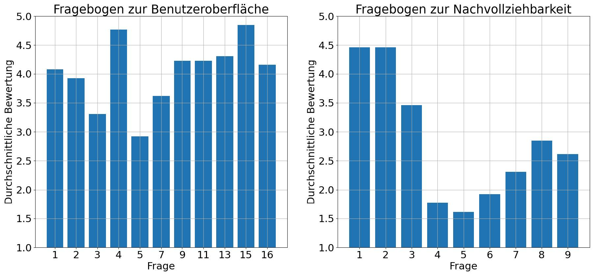

# Evaluation of the Cell View

An early version of the cell view was evaluated in a workshop-based formative evaluation in November 2023.

The purpose of the evaluation was to assess whether the main visual elements and interaction features were understandable and whether observers could follow relevant events and autonomous decisions in the production process.

As the cell view was still at an early stage of development and the results of the evaluation were primarily intended to guide further development, the evaluated version differs substantially from the version presented in the accompanying paper.

## Participants

The evaluation was conducted with three groups of approximately four to five participants. The groups differed in their prior knowledge of the HiFlex system:

1. participants directly involved in the development of HiFlex,
2. participants familiar with the project but not directly involved in its development, and
3. participants with little or no prior knowledge of HiFlex.

The grouping was intended to provide feedback from participants with different levels of familiarity with the system rather than to support a statistical comparison between the groups.

## Procedure

The evaluation was based on a guided demonstration of the visualization. Before the demonstration, participants received a questionnaire concerning the user interface. The questions concerning their understanding of the demonstrated production process were provided only afterwards, so that these questions did not direct their attention towards particular events during the demonstration.

The demonstrated scenario included the formation of two robot teams for parallel assembly operations, the failure and replacement of one robot arm, the subsequent formation of another team to combine the resulting subassemblies, and the movement of a mobile robot to a charging station.

## Questionnaire

The questionnaires contained 20 closed questions rated on a five-point scale from **1 (strongly disagree)** to **5 (strongly agree)** and eight open-ended questions for additional feedback.

The original German questions are provided [here](./questions-german.md). The English translations below are provided for convenience and were generated using DeepL with minimal manual adjustments.

### User Interface

Participants answered the following questions:

1. Are robotic arms clearly recognizable in the 2D representation?

2. Are AMRs (autonomous mobile robots) clearly recognizable in the 2D representation?

3. Is the charging station clearly recognizable in the 2D representation?

4. Are the fences surrounding the production facility clearly recognizable in the 2D representation?

5. Can you easily identify what parts robot arms or AMRs carry in their trays?

6. Thoughts on the 2D representations (open-ended question)

7. Do the info panels provide helpful information when you click or hover over components in the 2D representation?

8. Thoughts on the info panels (open-ended question)

9. Can team affiliations be easily identified in the 2D visualization?

10. Thoughts on the display of team affiliations (open-ended question)

11. Are failed or defective components sufficiently highlighted?

12. Thoughts on the display of failed components (open-ended question)

13. Is sufficient information about selected components displayed in the sidebar?

14. Thoughts on the various filters/display options in the sidebar

    (All Components, Team List, List of Selected Components). What information

    is missing?

15. Was it clear that completed scenarios can be replayed?

16. Are the markers for important events above the playback bar in the player helpful?

17. Thoughts on the player (open-ended question)

### Understanding of the Production Process

After observing the demonstrated scenario, participants answered the following questions:

1. Were the robot teams easy to tell apart?

2. Was the malfunction of the robot arm in the blue robot team obvious?

3. Was it clear that the malfunctioning robot was replaced by another one?

4. Were you able to see that Team 1 and Team 2 screwed a bracket onto a profile?

5. Were you able to follow that the two profiles with angle brackets were screwed together in the next step?

6. Were you able to follow that the subassemblies just produced could belong to different final products?

7. Were you able to observe the overall progress of the potential final products?

8. Were you able to tell whether trays were loaded with finished subassemblies?

9. Were you able to follow that AMR 3 charged its battery?

10. What information did you feel was missing to better understand the production process? (open-ended question)

11. Do you have any ideas about what additional information should be displayed to better understand the process? (open-ended question)

## Average Ratings of the Questions

The chart on the left shows the average ratings for each closed question about the user interface, while the chart on the right shows the average ratings for each closed question about the understandability of the production process.

Open-ended questions are not included.

## Main Findings

The evaluation indicated that the basic visual representation of the production cell was generally understandable. Participants could identify most resource types, and the visualization of robot-team membership and failed components was rated particularly positively. The demonstrated replacement of a failed robot by another robot was also recognized across the participant groups.

Several usability issues were nevertheless identified. In particular, the representation of the charging station and the contents of trays was less clear. Opinions also differed regarding the appropriate amount of detail in the information panels.

The replay functionality and its event markers were regarded as useful for inspecting previously executed scenarios. Feedback suggested that clearer differentiation of event types could further improve this functionality.

The main weakness concerned the visualization of the **production process rather than individual resources or teams**. Participants could recognize teams, failures, and team reconfiguration, but had considerably more difficulty determining which assembly operation a team was performing, following the creation and subsequent use of subassemblies, and understanding the progress and relationship of potential final products. In particular, the purpose for which a team had been formed was not sufficiently apparent from the cell view alone.

The open feedback therefore pointed towards a need for a representation of production tasks and product structure in addition to the spatial representation of the cell. Suggested improvements included clearer representations of subassemblies, explicit information about currently executed tasks, progress information, and a history of executed operations.

## Consequences for Later Development

These results were used to guide subsequent development of the visualization. Several identified issues were addressed in later versions of the cell view. More importantly, the difficulty of reconstructing production steps and product progress from a spatial cell visualization motivated the development of a separate **assembly plan view**, which complements the cell view with an explicit representation of tasks, dependencies, teams, and execution progress.
